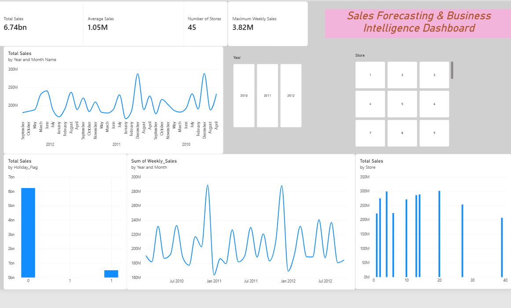
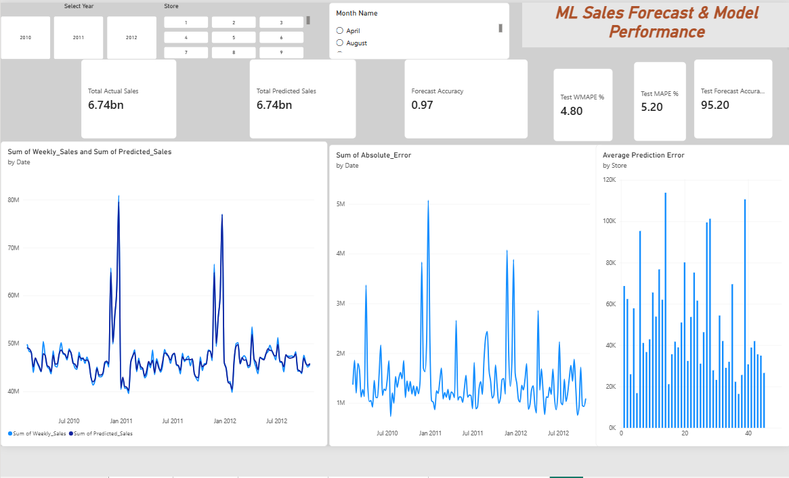
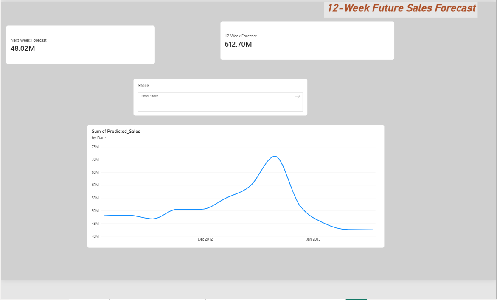
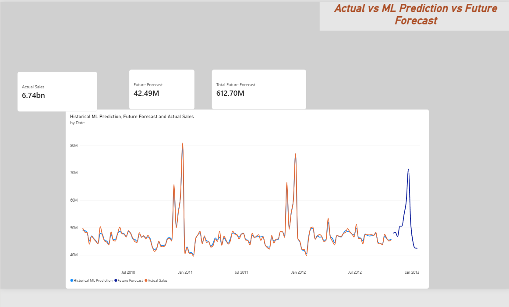
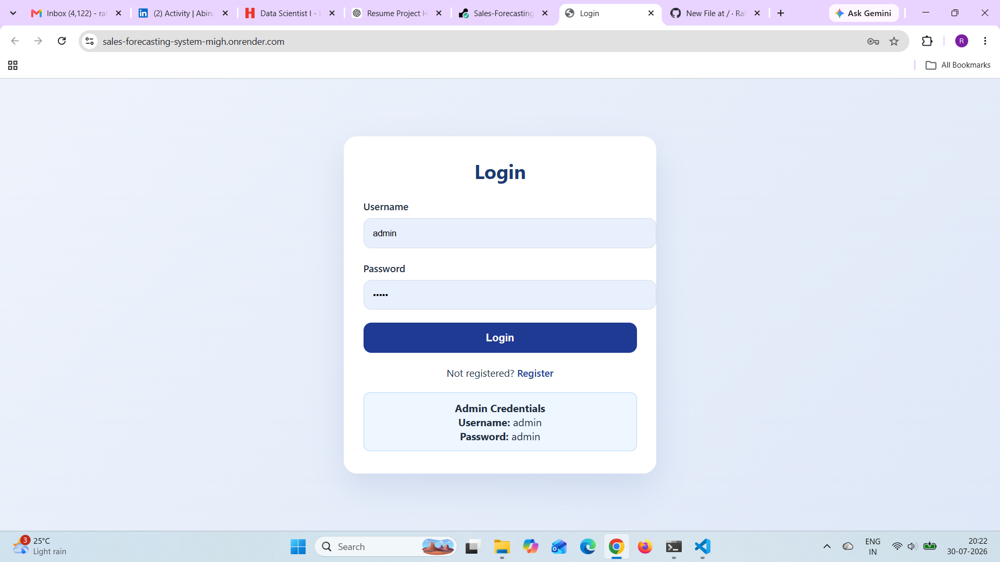
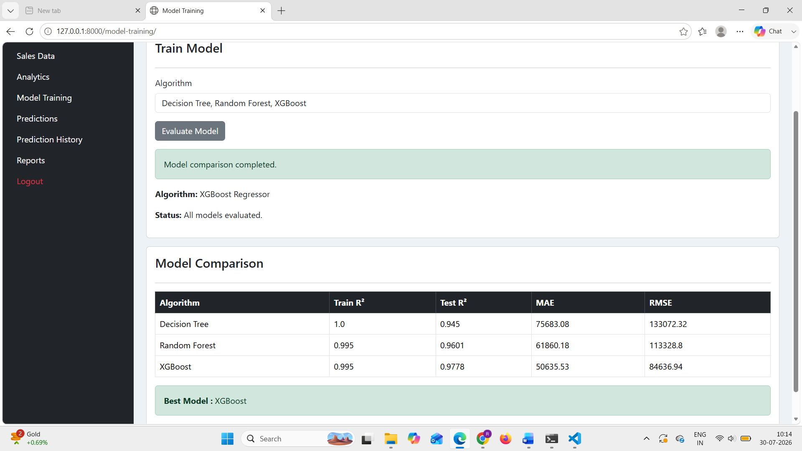

# 📈 Sales Forecasting System using Machine Learning

A web-based **Sales Forecasting System** built with **Python, Django, and Machine Learning** that enables organizations to upload sales datasets, train a forecasting model, predict future sales, and analyze business performance through role-based dashboards.

---

## 🚀 Live Demo

🌐 **Live Application:** https://sales-forecasting-system-migh.onrender.com

### Admin Login

- **Username:** `admin`
- **Password:** `admin`

---

## 💻 GitHub Repository

https://github.com/Rahuljogu/Sales-forecasting-system-using-machine-learning

---
## 📊 Dashboard Screenshots

### Sales Overview


### ML Forecast


### Future Forecast


### Combined Forecast

## 📌 Project Overview

The Sales Forecasting System helps organizations make data-driven decisions by predicting future sales using historical data. It provides separate dashboards for different users and allows administrators to manage datasets, train machine learning models, and generate accurate sales predictions.

---

## ✨ Features

### 👨‍💼 Admin

- Secure Login
- User Management
- Upload Sales Dataset
- Train Machine Learning Model
- Generate Sales Predictions
- View Prediction History
- Sales Reports
- Analytics Dashboard

### 👨‍💻 Manager

- Dashboard
- Sales Prediction
- Prediction History
- Business Analytics

### 📊 Analyst

- Dashboard
- Revenue Analysis
- Growth Analysis
- Store Performance Analysis
- Sales Trend Visualization

---

## 🤖 Machine Learning

- Random Forest Regressor
- Dataset Preprocessing
- Model Training
- Model Serialization using Joblib
- Real-time Sales Prediction

---

## 🛠️ Technologies Used

### Backend

- Python
- Django

### Machine Learning

- Scikit-learn
- Pandas
- NumPy
- Joblib

### Database

- SQLite3

### Frontend

- HTML5
- CSS3
- Bootstrap

### Deployment

- Render
- Gunicorn
- WhiteNoise

### Version Control

- Git
- GitHub

---

## 📂 Project Structure

```
salesforecast/
│
├── accounts/
├── admins/
├── analyst/
├── manager/
├── models/
├── media/
├── salesforecast/
├── templates/
├── manage.py
├── requirements.txt
└── db.sqlite3
```

---

## ⚙️ Installation

### Clone Repository

```bash
git clone https://github.com/Rahuljogu/Sales-forecasting-system-using-machine-learning.git
```

### Navigate to Project

```bash
cd Sales-forecasting-system-using-machine-learning
```

### Install Dependencies

```bash
pip install -r requirements.txt
```

### Apply Migrations

```bash
python manage.py migrate
```

### Run Server

```bash
python manage.py runserver
```

Open:

```
http://127.0.0.1:8000/
```

---

## 📊 Workflow

1. Login
2. Upload Sales Dataset
3. Train Machine Learning Model
4. Generate Sales Predictions
5. View Analytics
6. Download Reports

---

## 🎯 Project Highlights

- Role-Based Authentication
- Machine Learning Integration
- Dataset Upload
- Model Training
- Prediction History
- Analytics Dashboard
- Responsive User Interface
- Public Cloud Deployment

---

## 📷 Screenshots
## 🔐 Login Page



## Evaluate Model



## 📄 License

This project is developed for educational and portfolio purposes.

---

## 👨‍💻 Developer

**Rahul Jogu**

Python Developer | Django Developer | Machine Learning Enthusiast


LinkedIn:
[(Add your LinkedIn profile link here)](https://www.linkedin.com/in/jogu-rahul/)

---

⭐ If you found this project useful, consider giving it a star!
